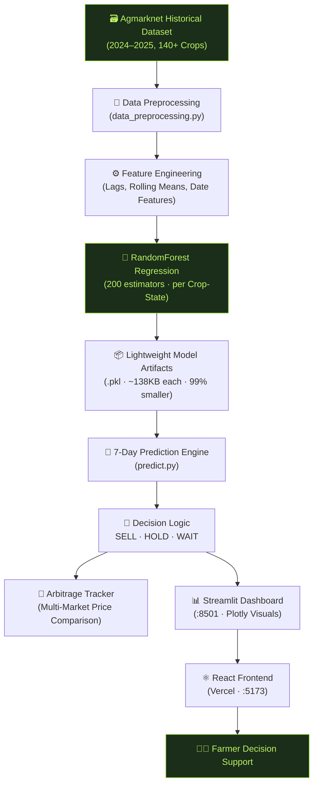

<div align="center">

<br/>


<br/>
<br/>

<h1>
  🌾 AgroAI — The Smart Selling Advisor
</h1>

<h3><em>From मेहनत to Profit: AI-Powered Market Intelligence for Every Indian Farmer</em></h3>

<br/>

[](https://agro-ai-swart.vercel.app/)
[](https://agroai-hz8vxvdraipem9jkahusut.streamlit.app/)
[](https://github.com/Daksh-cpu/AgroAI/stargazers)
[](./LICENSE)

<br/>

[](https://react.dev/)
[](https://vitejs.dev/)
[](https://tailwindcss.com/)
[](https://python.org/)
[](https://streamlit.io/)
[](https://scikit-learn.org/)
[](https://plotly.com/)
[](https://www.framer.com/motion/)

<br/>

> **86% of Indian farmers operate on small margins. A single wrong decision about when to sell can wipe out a season's profit.**
>
> **AgroAI changes that — permanently.**

<br/>

[**Problem**](#-the-problem) · [**Solution**](#-our-solution) · [**Demo**](#-live-demo) · [**Features**](#-key-features) · [**Architecture**](#-system-architecture) · [**Tech Stack**](#-tech-stack) · [**Quick Start**](#-quick-start) · [**API Keys**](#-api-integrations) · [**Roadmap**](#-roadmap)

<br/>

</div>

---

## 🚨 The Problem

India's 140 million small-scale farmers face a **life-altering** decision every harvest season: *when* to sell, and *where*.

| Challenge | Impact |
|:---|:---|
| 📉 Price uncertainty | Farmers sell at the wrong time, losing 20–40% of potential income |
| 📍 Market blindness | No visibility into which local mandi offers the best rate today |
| 📱 Digital gap | Complex data dashboards are inaccessible to the average farmer |
| 🌐 Language barrier | English-only tools exclude 80% of the target population |
| 🔮 No forecasting | Farmers rely on word-of-mouth, not data, for price predictions |

---

## 💡 Our Solution

**AgroAI** is an end-to-end AI Smart Selling Advisor that turns complex commodity market data into a single, clear, bilingual action — in seconds.

```
📊 Historical Agmarknet Data  →  🤖 RandomForest ML Engine  →  💹 SELL / HOLD / WAIT Signal
```

No data science degree required. No English required. Just a clear answer.

---

## 🎬 Live Demo

| Interface | URL |
|:---|:---|
| 🌐 React Frontend (Landing Page) | [agro-ai-swart.vercel.app](https://agro-ai-swart.vercel.app/) |
| 📊 Streamlit Dashboard (AI Engine) | [agroai-hz8vxvdraipem9jkahusut.streamlit.app](https://agroai-hz8vxvdraipem9jkahusut.streamlit.app/) |

---

## ✨ Key Features

<table>
<tr>
<td width="50%">

### 📈 7-Day Price Forecasting
Predicts short-term commodity prices using a **RandomForest Regression** model trained on verified government Agmarknet data (2024–2025) covering **140+ crops** across all major Indian states.

</td>
<td width="50%">

### ⚡ Instant SELL / HOLD / WAIT Signals
Removes all guesswork. Our decision engine computes whether the predicted 7-day average exceeds current price thresholds to produce a clear, color-coded recommendation.

</td>
</tr>
<tr>
<td>

### 📍 Multi-Market Arbitrage Tracker
Compares predicted prices across multiple local mandis to identify where a farmer can earn the **maximum net profit**, factoring in real market dynamics.

</td>
<td>

### 💰 Revenue Calculator
Farmers input their yield (in KG), and the app instantly computes their **estimated 7-day revenue** based on the AI's predicted price — bridging data to real income.

</td>
</tr>
<tr>
<td>

### 🌐 Bilingual (EN / हिन्दी)
Every UI string — buttons, labels, messages, chatbot responses — is fully localized in both English and Hindi. Language is never a barrier.

</td>
<td>

### 💬 Krishi Mitra Chatbot
A 24/7 AI farming assistant embedded directly in the landing page, designed to answer crop, weather, and market questions conversationally.

</td>
</tr>
</table>

---

## 🏗️ System Architecture



### Design Highlights

| Optimization | Before | After |
|:---|:---:|:---:|
| Model `.pkl` file size | ~100MB+ each | **~138KB each** ✅ |
| Peak RAM during training | ~500MB | **< 5MB** ✅ |
| CSV loading strategy | Full file load | **Line-by-line stream** ✅ |
| App startup time | 30+ seconds | **< 0.5 seconds** ✅ |
| Supports on-the-fly training | ✅ | ✅ (still active, now safe) |

---

## 🧰 Tech Stack

### Frontend
| Tool | Purpose |
|:---|:---|
| **React 19 + Vite 8** | Modern component-based UI with blazing-fast HMR |
| **TailwindCSS v4** | Utility-first styling with custom design tokens |
| **Framer Motion** | Fluid page animations and micro-interactions |
| **Phosphor Icons** | Consistent, crisp icon library |

### Backend & ML Engine
| Tool | Purpose |
|:---|:---|
| **Streamlit** | Rapid interactive dashboard with full Python ML support |
| **Scikit-Learn (RandomForest)** | Core price forecasting ML model |
| **Pandas + NumPy** | Data preprocessing and feature engineering |
| **Plotly** | Interactive charting (trend lines, arbitrage bars) |

### Infrastructure
| Tool | Purpose |
|:---|:---|
| **Vercel** | Frontend hosting with global CDN |
| **Streamlit Cloud** | Backend ML dashboard hosting |
| **GitHub Actions** | `keep_alive.yml` — auto-pings Streamlit every 12 hours to prevent sleep |
| **Git LFS** | Large file support for dataset versioning |

---

## 📁 Project Structure

```
AgroAI/
│
├── 📂 AgroAIdemo/                    # Python backend & ML engine
│   ├── 📄 app.py                     # Main Streamlit dashboard
│   ├── 📄 offline_train.py           # Batch model training (generates .pkl files)
│   ├── 📄 check_accuracy.py          # Model accuracy diagnostics
│   ├── 📄 verify_cache.py            # Cache validation tool
│   ├── 📄 requirements.txt           # Python dependencies
│   │
│   ├── 📂 src/                       # Core ML pipeline modules
│   │   ├── 📄 config.py              # Path constants
│   │   ├── 📄 data_preprocessing.py  # Data cleaning & normalization
│   │   ├── 📄 data_loader.py         # Memory-efficient CSV streaming loader ⚡
│   │   ├── 📄 feature_engineering.py # Lag features, rolling averages
│   │   ├── 📄 train_model.py         # RandomForest model definition
│   │   └── 📄 predict.py             # 7-day recursive forecasting engine
│   │
│   ├── 📂 models/                    # Pre-trained .pkl model artifacts (gitignored)
│   ├── 📂 assets/                    # Custom Streamlit CSS
│   └── 📂 agmarknet-india-commodity-prices-2024-2025/
│       └── 📄 agmarknet_india_historical_prices_2024_2025.csv  # ~97MB dataset
│
├── 📂 frontend/agroai-react/         # React + Vite frontend
│   ├── 📄 index.html
│   ├── 📄 vite.config.js
│   ├── 📄 .env.example               # Environment variable template
│   └── 📂 src/
│       ├── 📄 App.jsx                # Root component + routing logic
│       ├── 📄 index.css              # Tailwind + design tokens
│       ├── 📂 components/
│       │   ├── 📄 Navbar.jsx
│       │   ├── 📄 Hero.jsx
│       │   ├── 📄 PredictionCard.jsx # Live demo card with animated chart
│       │   ├── 📄 AIProcessingOverlay.jsx
│       │   └── 📂 Features/
│       │       └── 📄 BentoGrid.jsx
│       └── 📂 data/
│           └── 📄 translations.js    # EN / हिन्दी localization strings
│
├── 📂 assets/                        # Repo-level media
│   └── 🖼️ hero.png
│
├── 📂 .github/
│   └── 📂 workflows/
│       └── 📄 keep_alive.yml         # GitHub Action to ping Streamlit every 12h
│
├── 📄 .gitignore
└── 📄 README.md
```

---

## ⚡ Quick Start

### Prerequisites
- **Node.js** v18+
- **Python** 3.9+
- **Git** with optional Git LFS

### 1. Clone the Repository

```bash
git clone https://github.com/Daksh-cpu/AgroAI.git
cd AgroAI
```

### 2. Run the React Frontend

```bash
cd frontend/agroai-react

# Copy and configure environment variables
cp .env.example .env
# Edit .env and set VITE_STREAMLIT_APP_URL to your Streamlit URL

npm install
npm run dev
# → http://localhost:5173
```

### 3. Run the Streamlit Backend

Open a **new terminal** in the project root:

```bash
cd AgroAIdemo

# Create and activate virtual environment
python -m venv .venv

# Windows
.venv\Scripts\activate
# macOS/Linux
# source .venv/bin/activate

pip install -r requirements.txt

# (Optional) Pre-train all crop-state models for instant load times
python offline_train.py

# Launch the dashboard
streamlit run app.py
# → http://localhost:8501
```

> **💡 Note:** `offline_train.py` generates lightweight `~138KB` `.pkl` model files per crop-state combination inside `AgroAIdemo/models/`. These are git-ignored. If no `.pkl` is found, the app **automatically trains on-the-fly** using a memory-efficient streaming loader (safe for 1GB RAM cloud servers).

---

## 🌍 Deployment

### Frontend → Vercel

```bash
# In Vercel project settings:
Root Directory:    frontend/agroai-react
Build Command:     npm run build
Output Directory:  dist

# Environment Variables:
VITE_STREAMLIT_APP_URL  = https://your-app.streamlit.app
VITE_FRONTEND_APP_URL   = https://your-app.vercel.app
```

### Backend → Streamlit Community Cloud

```
Repository:   Daksh-cpu/AgroAI
Branch:       main
Main file:    AgroAIdemo/app.py

# Environment Variables (in Streamlit Secrets):
REACT_APP_URL = "https://your-app.vercel.app"
```

---

## 🔑 API Integrations

The following APIs unlock the next tier of AgroAI's capabilities:

| API | Feature Unlocked | Where to Get |
|:---|:---|:---|
| **Google Gemini API** | Krishi Mitra conversational AI (Hindi, Punjabi, Bengali) | [aistudio.google.com](https://aistudio.google.com) |
| **data.gov.in Agmarknet API** | Live daily mandi prices (replaces static CSV) | [data.gov.in](https://data.gov.in) |
| **Mappls (MapmyIndia) API** | Real driving distances for net-profit arbitrage | [maps.mapmyindia.com](https://maps.mapmyindia.com) |
| **Gupshup / Twilio API** | WhatsApp & SMS alerts for farmers | [gupshup.io](https://www.gupshup.io) |
| **Telegram Bot API** | Zero-friction crop query via Telegram | [core.telegram.org](https://core.telegram.org/bots) |

---

## 🚀 Roadmap

- [x] RandomForest price forecasting per crop-state
- [x] SELL / HOLD / WAIT decision engine
- [x] Multi-market arbitrage tracker
- [x] Bilingual UI (English + Hindi)
- [x] AI processing overlay & session state sync
- [x] Memory-efficient streaming data loader
- [x] Lightweight model pickle optimization (~99% size reduction)
- [x] GitHub Actions keep-alive workflow
- [ ] Live Agmarknet API integration (real-time prices)
- [ ] Gemini-powered Krishi Mitra chatbot
- [ ] Voice-to-voice multilingual AI assistant
- [ ] True net-profit arbitrage (MapmyIndia distance + transport cost)
- [ ] Crop disease diagnostics from leaf photos (multimodal AI)
- [ ] WhatsApp / Telegram bot for 2G/3G farmers
- [ ] n8n workflow automation layer

---

## 📊 ML Model Performance

| Metric | Value |
|:---|:---|
| Algorithm | RandomForest Regressor |
| Estimators | 200 trees |
| Max Depth | 15 |
| Features | Day, Month, Day-of-Week, Lag 1/2/3, Roll 3/7 |
| Training Split | 80% train / 20% test |
| Typical R² Score | **> 80%** (crop-state dependent) |
| Model Size (optimized) | **~138KB per crop-state** |
| Data Coverage | 140+ crops · 10+ states · 2024–2025 |

---

## 🤝 Contributing

Contributions are welcome from developers, data scientists, and domain experts in agriculture.

```bash
# Fork, then clone your fork
git clone https://github.com/YOUR_USERNAME/AgroAI.git

# Create a feature branch
git checkout -b feature/your-amazing-feature

# Commit your changes
git commit -m "feat: add your amazing feature"

# Push and open a Pull Request
git push origin feature/your-amazing-feature
```

Please keep pull requests focused on a single feature or fix. For major changes, open an issue first to discuss your proposal.

---

## 📄 License

This project is licensed under the **MIT License** — see the [LICENSE](./LICENSE) file for details.

---

<div align="center">

<br/>

**Built with ❤️ for India's farmers.**

*Data-Driven Agriculture. Inclusive by Design. Accessible to All.*

<br/>

[](https://github.com/Daksh-cpu/AgroAI)
[](https://agro-ai-swart.vercel.app/)
[](https://agroai-hz8vxvdraipem9jkahusut.streamlit.app/)

<br/>

*If AgroAI helped you, please ⭐ star this repository — it helps more farmers discover it.*

</div>